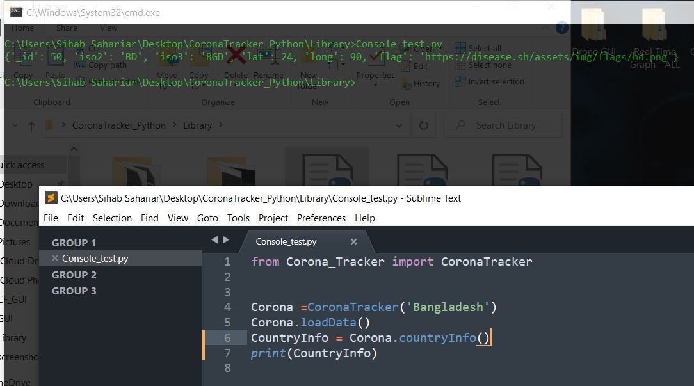
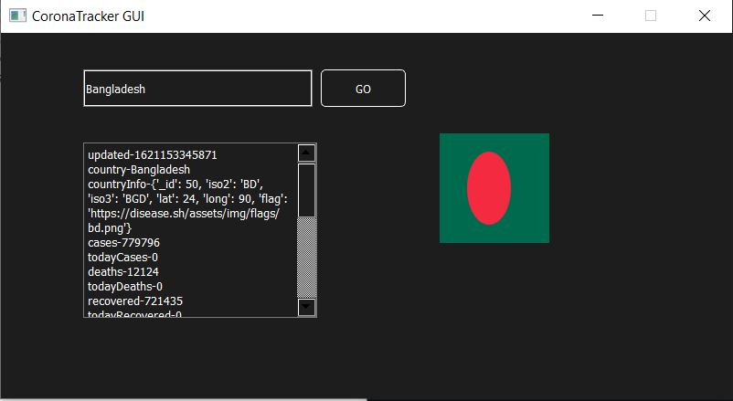
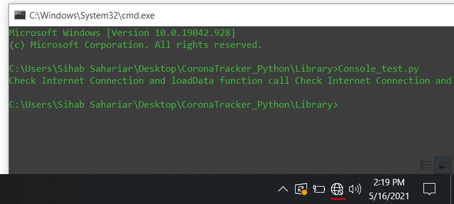

# CoronaTracker
Corona Tracker is an opensource python library to get information of a particular country about Corona Virus.
Using webscrapping technology I implemented it to use in various projects. There are 24 methods avialble to get information.
- 3rd Party Library Used (For Library): urllib , json
- 3rd Party Library Used (For GUI) : PyQt5


The methods are listed here -
- [x] updated
- [x] country 
- [x] countryInfo 
- [x] cases 
- [x] todayCases 
- [x] deaths 
- [x] todayDeaths 
- [x] recovered 
- [x] todayRecovered
- [x] active 
- [x] critical 
- [x] casesPerOneMillion 
- [x] deathsPerOneMillion 
- [x] tests 
- [x] testsPerOneMillion 
- [x] population 
- [x] continent 
- [x] oneCasePerPeople 
- [x] oneDeathPerPeople 
- [x] oneTestPerPeople 
- [x] undefined 
- [x] activePerOneMillion 
- [x] recoveredPerOneMillion 
- [x] criticalPerOneMillion 


How to Call Library?
----------------------
````md
 from Corona_Tracker import CoronaTracker #importing the library
 Corona =CoronaTracker('Bangladesh') #Give contry name as parameter 
 Corona.loadData()  #Calling the loadData function to get all the information 
 TodayCase = Corona.todayCases ()   #Getting today's corona virus case number from the loaded data.   
````

Screenshot:
-----------------

          

          

